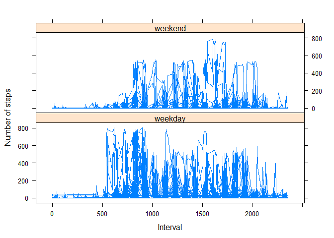

# PA1_template
akhilendra  
Sunday, July 19, 2015  

###About

This assignment makes use of data from a personal activity monitoring device. This device collects data at 5 minute intervals through out the day. The data consists of two months of data from an anonymous individual collected during the months of October and November, 2012 and include the number of steps taken in 5 minute intervals each day.


##Synopsis
The purpose of this project was to practice:

* loading and preprocessing data
* imputing missing values
* interpreting data to answer research questions

## Data
The data for this assignment was downloaded from the course web
site:

* Dataset: [Activity monitoring data](https://d396qusza40orc.cloudfront.net/repdata%2Fdata%2Factivity.zip) [52K]

The variables included in this dataset are:

* **steps**: Number of steps taking in a 5-minute interval (missing
    values are coded as `NA`)

* **date**: The date on which the measurement was taken in YYYY-MM-DD
    format

* **interval**: Identifier for the 5-minute interval in which
    measurement was taken

The dataset is stored in a comma-separated-value (CSV) file and there are a total of 17,568 observations in this dataset.

## Loading and preprocessing the data

Download, unzip and load data into data frame `data`.


```r
setwd("C:\\Users\\akhilendrapratap\\Documents\\Data science notes\\R Course\\Reproducible Research\\repdata_data_activity")
data<-read.csv("activity.csv")
```

## What is mean total number of steps taken per day?
For this part of the assignment, you can ignore the missing values in the dataset.
1.  Calculate the total number of steps taken per day
2.	If you do not understand the difference between a histogram and a barplot, research the difference between them. Make a histogram of the total number of steps taken each day
3.	Calculate and report the mean and median of the total number of steps taken per day


```r
datana<-na.omit(data)
dataag<-aggregate(steps ~ date, datana, sum)
head(datana)
```

```
##     steps       date interval
## 289     0 2012-10-02        0
## 290     0 2012-10-02        5
## 291     0 2012-10-02       10
## 292     0 2012-10-02       15
## 293     0 2012-10-02       20
## 294     0 2012-10-02       25
```

```r
meanstep<-mean(datana$steps)

mediansteps<-median(dataag$steps)

colors = c("red", "yellow", "green", "violet","blue")
duration<-dataag$steps
hist(duration, right=FALSE, col=colors,main = "Histogram of Steps",xlab="Steps")
```

 

The `mean` is 37.3825996 and the `median` is 10765.I have used R base plotting system for this histogram.

## What is the average daily activity pattern?

* Calculate average steps for each interval for all days. 
* Plot the Average Number Steps per Day by Interval. 
* Find interval with most average steps. 

```r
intervaldata <- aggregate(steps ~ interval, data, mean)
plot(intervaldata$interval,intervaldata$steps, type="l", xlab="Interval", ylab="Number of Steps",main="Average Number of Steps per Day by Interval")
```

 

```r
intermax <- intervaldata[which.max(intervaldata$steps),1]
```

The 5-minute interval, on average across all the days in the data set, containing the maximum number of steps is 835.

## Impute missing values. Compare imputed to non-imputed data.
1.  Calculate and report the total number of missing values in the dataset (i.e. the total number of rows with NAs)
2.	Devise a strategy for filling in all of the missing values in the dataset. The strategy does not need to be sophisticated. For example, you could use the mean/median for that day, or the mean for that 5-minute interval, etc.
3.	Create a new dataset that is equal to the original dataset but with the missing data filled in.
4.	Make a histogram of the total number of steps taken each day and Calculate and report the mean and median total number of steps taken per day. Do these values differ from the estimates from the first part of the assignment? What is the impact of imputing missing data on the estimates of the total daily number of steps?


```r
row.na <- apply(data, 1, function(x){any(is.na(x))})
totalna<-sum(row.na)
```
Total number of rows with NA in given data are 'r totalna'

The method to impute the value is by assigning the average number of steps for each interval into those intervals with NA's. With the imputed missing values we will create a histogram and calculate a mean and median as before.


```r
dataimput <- data
nadata <- is.na(dataimput$steps)
intervalavg <- tapply(datana$steps, datana$interval, mean, na.rm=TRUE, simplify=T)
dataimput$steps[nadata] <- intervalavg[as.character(dataimput$interval[nadata])]
newdata<- tapply(dataimput$steps, dataimput$date, sum, na.rm=TRUE, simplify=T)

hist(x=newdata,
     col="blue",
     breaks=20,
     xlab="daily steps",
     ylab="frequency",
     main="The distribution of daily total (with missing data imputed)")
```

 

```r
totalmean<-mean(newdata)
totalmedian<-median(newdata)

meandiff <- totalmean-meanstep

meddiff <- totalmedian- mediansteps
```
* The imputed data mean is 1.0766189\times 10^{4}
* The imputed data median is 1.0766189\times 10^{4}
* The difference between the non-imputed mean and imputed mean is 1.0728806\times 10^{4}
* The difference between the non-imputed mean and imputed mean is 1.1886792

## Are there differences in activity patterns between weekdays and weekends?
#Create a new factor variable in the dataset with two levels - "weekday" and "weekend" indicating whether a given date is a weekday or weekend day.
#	Make a panel plot containing a time series plot (i.e. type = "l") of the 5-minute interval (x-axis) and the average number of steps taken, averaged across all weekday days or weekend days (y-axis). See the README file in the GitHub repository to see an example of what this plot should look like using simulated data.


```r
library(dplyr)
```

```
## 
## Attaching package: 'dplyr'
## 
## The following object is masked from 'package:stats':
## 
##     filter
## 
## The following objects are masked from 'package:base':
## 
##     intersect, setdiff, setequal, union
```

```r
weekdate<-as.POSIXct(dataimput$date)
dataimput <- mutate(dataimput, weektype = ifelse(weekdays(weekdate) == "Saturday" | weekdays(weekdate) == "Sunday", "weekend", "weekday"))
dataimput$weektype <- as.factor(dataimput$weektype)
head(dataimput)
```

```
##       steps       date interval weektype
## 1 1.7169811 2012-10-01        0  weekday
## 2 0.3396226 2012-10-01        5  weekday
## 3 0.1320755 2012-10-01       10  weekday
## 4 0.1509434 2012-10-01       15  weekday
## 5 0.0754717 2012-10-01       20  weekday
## 6 2.0943396 2012-10-01       25  weekday
```

```r
weekpattern <- aggregate(steps ~ interval+dataimput$weektype, dataimput, mean)

library(lattice)


xyplot(steps ~ interval | factor(dataimput$weektype),
       layout = c(1, 2),
       xlab="Interval",
       ylab="Number of steps",
       type="l",
       lty=1,
       data=dataimput)
```

 
